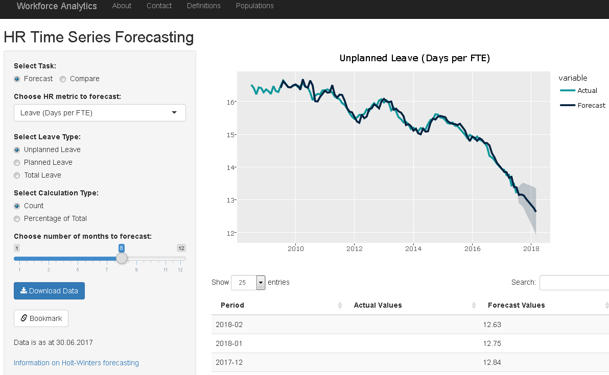

# Time Series and forecasting

View and compare a range of workforce related time series.



## Prerequisites

This application requires an instance of [Shiny Server](https://www.rstudio.com/products/shiny/shiny-server/)
and the dependencies listed under [Built With](#built-with).

## Input Data Definition
Below is a `dplyr::glimpse()` of the data used in the application and classes of the columns.

```
> glimpse(df)
Observations: 120
Variables: 57
$ Snpsht_Dt            (date) 2007-07-31, 2007-08-31, 2007-09-30, 2007-10-31, 2007-11-30, 2007-12...
$ plR12                (dbl) NA, NA, NA, NA, NA, NA, NA, NA, NA, NA, NA, 34.48513, 34.60494, 34.4...
$ uplR12               (dbl) NA, NA, NA, NA, NA, NA, NA, NA, NA, NA, NA, 16.51291, 16.41070, 16.2...
$ totR12               (dbl) NA, NA, NA, NA, NA, NA, NA, NA, NA, NA, NA, 50.99804, 51.01564, 50.6...
$ ongHC                (int) 21420, 21460, 21478, 21659, 21699, 21935, 22514, 22534, 22510, 22482...
$ ongHC_Adelaide       (int) 39, 46, 45, 53, 52, 50, 55, 63, 94, 102, 93, 96, 79, 91, 111, 110, 1...
... # A-Z of ATO sites
$ ongHC_Wollongong     (int) 272, 268, 266, 269, 265, 265, 258, 251, 260, 272, 270, 268, 268, 268...
$ ongFTE               (dbl) NA, NA, NA, NA, NA, NA, NA, NA, NA, NA, NA, NA, NA, NA, NA, NA, NA, ...
$ nonHC                (int) 1301, 1295, 1331, 1275, 1223, 929, 876, 906, 738, 723, 828, 997, 104...
$ nonFTE               (dbl) NA, NA, NA, NA, NA, NA, NA, NA, NA, NA, NA, NA, NA, NA, NA, NA, NA, ...
$ casHC                (int) 663, 640, 640, 660, 755, 731, 746, 732, 676, 669, 625, 878, 1007, 10...
$ casFTE               (dbl) NA, NA, NA, NA, NA, NA, NA, NA, NA, NA, NA, NA, NA, NA, NA, NA, NA, ...
$ totHC                (int) 23384, 23395, 23449, 23594, 23676, 23594, 24135, 24171, 23923, 23873...
$ totFTE               (dbl) NA, NA, NA, NA, NA, NA, NA, NA, NA, NA, NA, NA, NA, NA, NA, NA, NA, ...
$ totNESB_HC           (int) NA, NA, NA, NA, NA, NA, NA, NA, NA, NA, NA, NA, NA, NA, NA, NA, NA, ...
$ totIdgn_HC           (int) NA, NA, NA, NA, NA, NA, NA, NA, NA, NA, NA, NA, NA, NA, NA, NA, NA, ...
$ totDsbl_HC           (int) NA, NA, NA, NA, NA, NA, NA, NA, NA, NA, NA, NA, NA, NA, NA, NA, NA, ...
$ totNESB_pct          (dbl) NA, NA, NA, NA, NA, NA, NA, NA, NA, NA, NA, NA, NA, NA, NA, NA, NA, ...
$ totIdgn_pct          (dbl) NA, NA, NA, NA, NA, NA, NA, NA, NA, NA, NA, NA, NA, NA, NA, NA, NA, ...
$ totDsbl_pct          (dbl) NA, NA, NA, NA, NA, NA, NA, NA, NA, NA, NA, NA, NA, NA, NA, NA, NA, ...
$ ongNESB_HC           (int) NA, NA, NA, NA, NA, NA, NA, NA, NA, NA, NA, NA, NA, NA, NA, NA, NA, ...
$ ongIdgn_HC           (int) NA, NA, NA, NA, NA, NA, NA, NA, NA, NA, NA, NA, NA, NA, NA, NA, NA, ...
$ ongDsbl_HC           (int) NA, NA, NA, NA, NA, NA, NA, NA, NA, NA, NA, NA, NA, NA, NA, NA, NA, ...
$ ongNESB_pct          (dbl) NA, NA, NA, NA, NA, NA, NA, NA, NA, NA, NA, NA, NA, NA, NA, NA, NA, ...
$ ongIdgn_pct          (dbl) NA, NA, NA, NA, NA, NA, NA, NA, NA, NA, NA, NA, NA, NA, NA, NA, NA, ...
$ ongDsbl_pct          (dbl) NA, NA, NA, NA, NA, NA, NA, NA, NA, NA, NA, NA, NA, NA, NA, NA, NA, ...
$ age                  (dbl) 43.64324, 43.65079, 43.66216, 43.62864, 43.65293, 43.62243, 43.32031...
$ atoTnr               (dbl) 11.35906, 11.33136, 11.31642, 11.23907, 11.22167, 11.09309, 10.83317...
$ apsTnr               (dbl) 12.90140, 12.87842, 12.86884, 12.79163, 12.77727, 12.64714, 12.36901...
$ avgFemSal            (dbl) 63702.09, 63794.61, 63947.68, 63956.50, 64042.84, 63866.72, 64779.68...
$ avgMaleSal           (dbl) 70782.72, 70871.96, 71055.70, 71050.66, 71078.89, 70923.29, 71915.27...
$ Slry_Pct             (dbl) 89.99667, 90.01390, 89.99655, 90.01535, 90.10108, 90.05042, 90.07779...
$ Nat_Atrr_R12         (dbl) NA, NA, NA, NA, NA, NA, NA, NA, NA, NA, NA, NA, 5.886513, 5.824822, ...
$ Rdncy_R12            (dbl) NA, NA, NA, NA, NA, NA, NA, NA, NA, NA, NA, NA, 0.5032825, 0.5211055...
$ Tot_Attr_R12         (dbl) NA, NA, NA, NA, NA, NA, NA, NA, NA, NA, NA, NA, 6.389795, 6.345928, ...
```

## Style Guide Used
[Google's R Style Guide](https://google.github.io/styleguide/Rguide.xml)

## Built With
* [Shiny](https://shiny.rstudio.com/) - Web Framework for R
* [Plotly](https://plot.ly/r/) - Interactive Plots
* [readr](https://cran.r-project.org/web/packages/readr/README.html) - Fast I/O of tabular data
* [lubridate](https://cran.r-project.org/package=lubridate) - Date handling
* [dplyr](http://dplyr.tidyverse.org/) - data wrangling

### Package Versions Used
A full list of packages used for this application can be found in the [packrat.lock](./packrat/packrat.lock) file.

## Authors
[List of contributors](http://gitlab.radlab.local/workforce/shinyApps/forecastMetrics/graphs/master)

## License

This project is licensed under the MIT License - see the [LICENSE.md](LICENSE.md) file for details

## Acknowledgments
* [Open Government Australia](https://www.dta.gov.au/standard/8-make-source-code-open/)
* [The People’s Code](https://code.gov/#/)
